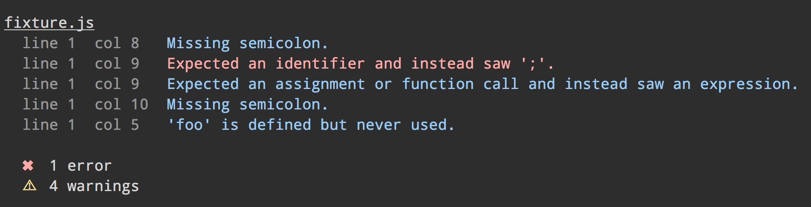
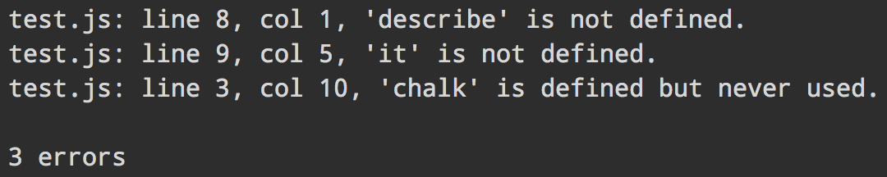

# jshint-stylish [](https://travis-ci.org/sindresorhus/jshint-stylish)

> Stylish reporter for [JSHint](https://github.com/jshint/jshint)



Compared to the default reporter:




## Install

```
$ npm install --save-dev jshint-stylish
```


## Usage

### JSHint CLI

```
$ jshint --reporter=node_modules/jshint-stylish file.js
```

### [gulp-jshint](https://github.com/spalger/gulp-jshint)

```js
gulp.task('default', function () {
	gulp.src(['file.js'])
		.pipe(jshint('.jshintrc'))
		.pipe(jshint.reporter('jshint-stylish', {verbose: true}));
});
```

### [grunt-contrib-jshint](https://github.com/gruntjs/grunt-contrib-jshint)

```js
grunt.initConfig({
	jshint: {
		options: {
			reporter: require('jshint-stylish')
		},
		target: ['file.js']
	}
});

grunt.loadNpmTasks('grunt-contrib-jshint');
grunt.registerTask('default', ['jshint']);
```

### Options
- `color`
    Default is `'blue'`, but it can be anything supported by [chalk](https://github.com/sindresorhus/chalk).
    On terminals with dark gray background, `{color:'green'}` would likely
    appear somewhat friendlier than blue.
- `sort`
    Sorts the output by lines and columns; default is `true`.
- `verbose`
    Makes the menacing jshint code like `(W106)` to appear after the message.
    Default is `false`.

## License

MIT © [Sindre Sorhus](http://sindresorhus.com)
